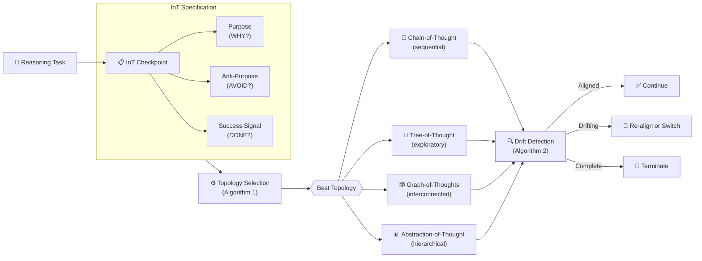
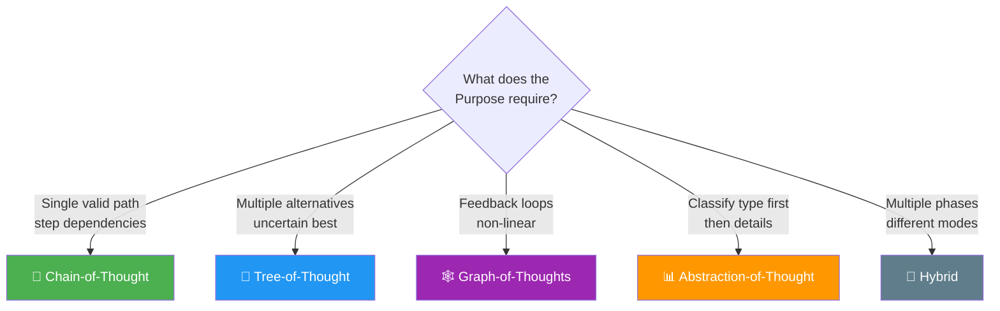

# Intent of Thought (IoT)

> A Pre-Reasoning Governance Layer for Topology Selection in LLM Reasoning

[](https://arxiv.org/abs/XXXX.XXXXX)
[](LICENSE)
[](https://python.org)

---

## The Problem

LLMs can reason using many structures: chains, trees, graphs, and more. But **how do you pick the right one?**

```
Without IoT                          With IoT
─────────────                        ────────
                                     
"Solve this problem"                 "WHY am I reasoning?"
       │                             "What must I AVOID?"
       ▼                             "HOW will I know I succeeded?"
  Always uses CoT                           │
  (hope for the best)                       ▼
                                     Select the RIGHT topology
                                     for THIS specific task
```

## How IoT Works



## The IoT Triple

Every reasoning task gets a three-part checkpoint before topology selection:

```
IoT = (Purpose, Anti-Purpose, Success Signal)
```

| Primitive | Question | What It Prevents |
|-----------|----------|-----------------|
| **Purpose** | WHY are we reasoning? | Aimless computation |
| **Anti-Purpose** | What must we AVOID? | Technically valid but useless output |
| **Success Signal** | HOW will we know? | Reasoning that never terminates |

## Selection Table



## Case Studies

| Case | Task | IoT Recommends | Why |
|------|------|:--------------:|-----|
| 1 | Mathematical proof | 📝 **CoT** | Single valid path, each step depends on previous |
| 2 | UI design challenge | 🌳 **ToT** | Must explore 3+ alternatives before committing |
| 3 | Hospital readmission analysis | 🕸️ **GoT** | Feedback loops between staffing, planning, education |

## Quick Start

```python
from iot import IntentOfThought, TopologySelector

# Define your intent
iot = IntentOfThought(
    purpose="Map causal relationships between hospital readmission factors",
    anti_purpose="Treating factors as independent when they interact",
    success_signal="Relationship map with bidirectional dependencies and feedback loops"
)

# Select topology
selector = TopologySelector()
result = selector.select(iot, context="systems analysis")

print(result)
# => Recommended: GoT
#    The Purpose involves interconnected factors with feedback
#    loops, requiring a graph structure for refinement and merging.
```

## Repository Structure

```
intent-of-thought/
├── README.md                 # This file
├── LICENSE                   # Apache 2.0
├── paper/
│   ├── intent_of_thought.md  # Full paper (readable)
│   └── references.bib        # Bibliography (21 entries)
├── iot/
│   ├── __init__.py
│   ├── specification.py      # IoT triple: Purpose, Anti-Purpose, Success Signal
│   ├── selector.py           # Algorithm 1: Topology Selection
│   └── drift.py              # Algorithm 2: Intent Drift Detection
└── examples/
    ├── case1_sequential.py   # Mathematical proof → CoT
    ├── case2_parallel.py     # UI design → ToT
    └── case3_interconnected.py # Hospital analysis → GoT
```

## Citation

```bibtex
@article{mohamedkani2026intent,
  title={Intent of Thought: A Pre-Reasoning Governance Layer for
         Topology Selection in LLM Reasoning},
  author={Mohamed Kani, Naveen Riaz},
  journal={arXiv preprint},
  year={2026}
}
```

## Author

**Naveen Riaz Mohamed Kani**
ORCID: [0009-0003-9173-2425](https://orcid.org/0009-0003-9173-2425)

## License

Apache 2.0. See [LICENSE](LICENSE) for details.
