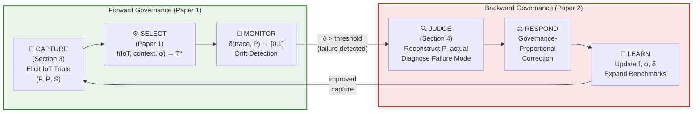
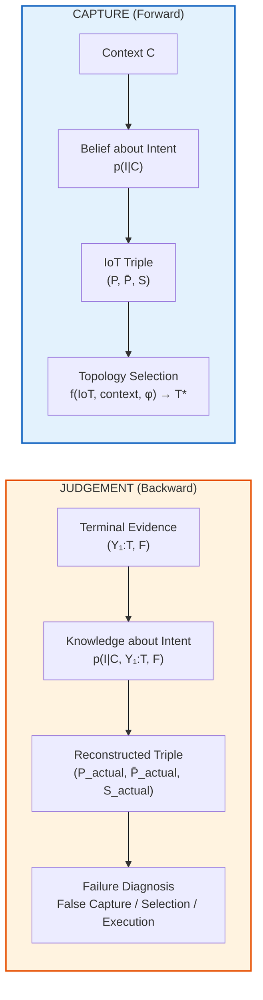

# Figure 1: The IoT Lifecycle

> **Purpose**: Visual centrepiece of Paper 2. Referenced in Section 1 (Introduction) and throughout.
> **Format**: Mermaid source + LaTeX TikZ description for production.

---

## Mermaid Source (preview rendering)

## Dual-Diagram: Temporal Symmetry

---

## LaTeX TikZ Description (for production)

The diagram should be rendered as TWO parts:

### Part A: The Lifecycle Loop (horizontal)

Six nodes arranged in an oval/racetrack layout:
- **Top row** (left to right): CAPTURE → SELECT → MONITOR (green shading, "Forward Governance")
- **Bottom row** (right to left): JUDGE → RESPOND → LEARN (red/orange shading, "Backward Governance")
- Arrow from MONITOR down to JUDGE (labelled "δ > threshold")
- Arrow from LEARN back up to CAPTURE (labelled "improved capture")
- Each node shows: name, section reference, key operation

### Part B: Temporal Symmetry Inset (small, bottom-right)

Two columns side by side:
- Left: "CAPTURE (Forward)" with arrow from Context → Belief → IoT Triple → Topology
- Right: "JUDGEMENT (Backward)" with arrow from Evidence → Knowledge → Reconstructed Triple → Diagnosis
- Label between: "Same operator L(I;E), different evidence"
- Blue shading (forward), orange shading (backward)

### Figure Caption

"Figure 1: The IoT Lifecycle. The forward half (Capture → Select → Monitor) constructs and governs reasoning; the backward half (Judge → Respond → Learn) diagnoses failures and feeds corrections back to capture. Together they complete a closed governance loop. Inset: Capture and Judgement are structurally symmetric, both performing intent inference under epistemic asymmetry, with Capture conditioning on belief (pre-reasoning) and Judgement conditioning on observation (post-failure)."

---

## Key Design Decisions

1. **Racetrack, not circle**: emphasises forward/backward distinction
2. **Colour coding**: green (forward, Paper 1 territory), red/orange (backward, Paper 2 contribution)
3. **Section references**: each node links to paper section for reader navigation
4. **Inset**: temporal symmetry is visually compact, not overemphasised (SPAR #33 constraint)
5. **No MAPE-K labels**: MAPE-K is cited in text, not shown in diagram (avoids direct visual comparison)
